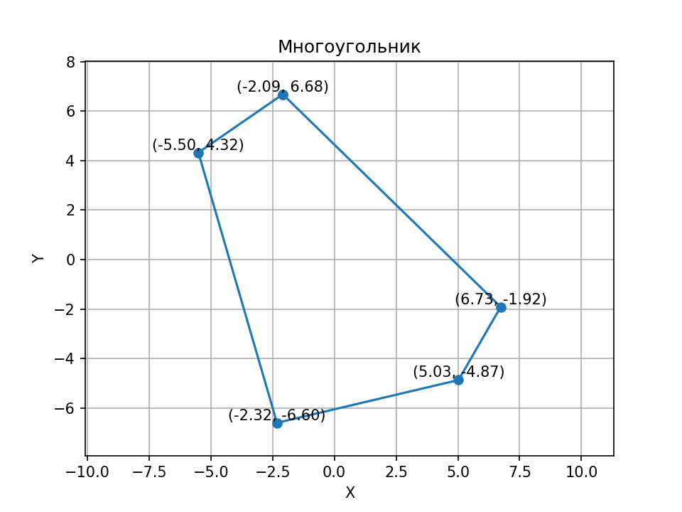

# Polygon Package

Это пакет Python, предоставляющий инструменты для работы с многоугольниками, включая создание, преобразование и визуализацию.

## Установка

Для установки пакета, выполните следующую команду:

```bash
py -m pip install --index-url https://test.pypi.org/simple/ --no-deps polygon-package-LyoshaGodX
```

## Использование

### Использование через консольный интерфейс

Для удобного использования функционала пакета, можно использовать функцию `menu`, в которой доступна генерация, преобразование и визуализация многоугольников

```python
form polygon_package import menu

menu()
```

### Создание многоугольника

Для создания многоугольника, вы можете использовать функции `create_regular_polygon` или `create_irregular_polygon`:

```python
form polygon_package import create_regular_polygon, create_irregular_polygon

# Создание правильного многоугольника с 5 вершинами и длиной стороны 2.0
polygon = create_regular_polygon(num_vertices=5, side_length=2.0)

# Создание неправильного многоугольника с 6 вершинами, вписанного в окружность радиусом 3
polygon = create_irregular_polygon(num_vertices=6, radius=3.0)
```

### Применение преобразований к многоугольнику

Для преобразования многоугольников вы можете использовать функции `scale_polygon`, `translate_polygon` и `rotate_polygon`

```python
form polygon_package import scale_polygon, translate_polygon, rotate_polygon

# Увеличение прямоугольника в полтора раза по каждой оси
scaled_polygon = scale_polygon(polygon, scale_x=1.5, scale_y=1.5)

# Перемещение многоугольника на 2 единицы по оси X и на 3 единицы по оси Y
translated_polygon = translate_polygon(polygon, translate_x=2.0, translate_y=3.0)

# Вращение многоугольника на 45 градусов по часовой стрелке
rotated_polygon = rotate_polygon(polygon, angle=45, clockwise=True)
```

### Визуализация многоугольника

Для визуализации многоугольника и преобразования одного многоугольника в другой можно использовать функции `plot_polygon` и `plot_polygons_transition`

```python
form polygon_package import plot_polygon, plot_polygons_transition

# Визуализация многоугольника и координат его вершин c разрешением графика в 150 DPI и отступом от границ в 0.1. 
plot_polygon(polygon, dpi=150, margin=0.1)

# Визуализация перехода между двумя многоугольниками
plot_polygons_transition(polygon1, polygon2)
```





## Авторы

- [Лёха](https://github.com/LyoshaGodX)
- [Данила](https://github.com/dant4ick)
